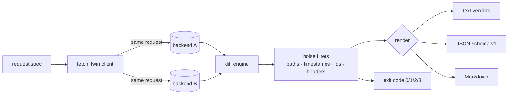

# twinget

[English](README.md) | [中文](README.zh.md) | [日本語](README.ja.md)

[](LICENSE) [](go.mod) [](CHANGELOG.md)  [](CONTRIBUTING.md)

**twinget：同じリクエストを 2 つのバックエンドへ送り、ステータス・ヘッダ・JSON を構造的に diff するオープンソースの依存ゼロ CLI。タイムスタンプと id のノイズフィルタを内蔵し、「レスポンスの同一性」を本当に証明可能にする。**


```bash
git clone https://github.com/JaydenCJ/twinget && cd twinget
go build -o twinget ./cmd/twinget    # single static binary, stdlib only
```

> プレリリース：v0.1.0 はまだどのパッケージレジストリにも公開していません。上記のとおりソースからビルドしてください（Go ≥1.22 ならどれでも可）。

## なぜ twinget？

v1 から v2、Node から Go、モノリスからサービスへ——あらゆる書き直しと移行は最後に同じ問いへ行き着く。*新しいバックエンドは古いものとまったく同じ答えを返すのか？* Twitter の Diffy はこの問いに答える価値を証明したが、Diffy はダッシュボードと JVM を伴い、本番トラフィックをプロキシ経由で流し込む必要のある、デプロイ前提の Scala サービスだ。「ラップトップや staging にポートが 2 つ開いているだけ」という日常のケースには儀式が重すぎる。一方の素手の代替、`curl` を `diff` にパイプする方法は即座に破綻する。レスポンスごとに新しい request id、新しいタイムスタンプ、異なる `Server` ヘッダが付くため、すべてが「違う」ことになり何も学べない。twinget はその中間を埋める。1 つのスタティックバイナリがリクエストを両バックエンドへミラーし、ステータス・ヘッダ・JSON を*構造的に*比較し（キー順や数値表記で誤検知しない）、文書化された保守的なフィルタで値レベルのノイズを中和する——型変化は決して隠さず、何を抑制したかを常に報告しながら。

| | twinget | Diffy / OpenDiffy | curl + jq + diff | 契約テスト（Pact など） |
|---|---|---|---|---|
| 実行形態 | 単一バイナリ CLI | 要デプロイの JVM サービス + プロキシ | シェルスクリプト | コードベース内のテスト |
| パス付き構造的 JSON diff | ✅ `$.users[2].email` | ✅ | ❌ テキスト行 | ⚠️ スキーマ水準 |
| タイムスタンプ / id ノイズフィルタ | ✅ ルールを文書化 | ✅ 統計的 | ❌ 手書き jq | 対象外 |
| 型変化を決して隠さない | ✅ 保証付き | ❌ ノイズ判定が統計的 | ❌ | ✅ |
| パイプライン向け終了コード | ✅ 0/1/2/3 | ❌ ダッシュボード | ⚠️ 自作 | ✅ |
| 最初の diff までの準備 | `go build` | デプロイ + 流量誘導 | スクリプト書き | 契約書き |
| ランタイム依存 | 0（Go 標準ライブラリ） | JVM + サービス一式 | curl、jq | ライブラリ + broker |

<sub>2026-07-12 時点で確認：twinget は Go 標準ライブラリのみを import。opendiffy/diffy は Scala/Finagle 製サービスで、公式 Docker イメージ経由で動かす。</sub>

## 機能

- **双子ミラーリング、正直なキャプチャ** —— 同一のメソッド・ヘッダ・ボディ・クエリ文字列で両方の base URL へ並行送信。リダイレクトは意図的に追わない。片側だけの `301` こそが*発見*だからだ。
- **構造的 JSON diff** —— ボディはテキストではなく木として比較。キー順や数値表記（`1.0` vs `1`、`1e3` vs `1000`）は決して偽の差分を生まず、すべての差分は `$.users[2].email` のような正確なパスに、名前付きの種別（`value`、`type`、`only in a/b`、`length`）とともに着地する。
- **証跡を残すノイズフィルタ** —— `--ignore-timestamps` と `--ignore-ids` は、*両側*が同じ文書化された形状（RFC 3339 / epoch、UUID / ULID / hex / 同一プレフィックス id）に一致するときだけ中和。抑制された差分は集計され、`--show-ignored` で列挙でき、JSON 出力には常に含まれる。
- **型変化は必ず表面化** —— 文字列タイムスタンプが epoch 数値になった、`2` が `"2"` になった——どちらもクライアントを壊す。どのフィルタもこれを隠せない。
- **パスと順序の制御** —— `--ignore '$.meta.**'` はサブツリー全体を沈黙させ、`--unordered '$.items'` はその配列だけを多重集合として比較し、要素内に入れ子の配列までは緩めない。
- **精選ノイズリスト付きヘッダ diff** —— 21 個の揮発性ヘッダ（`date`、`x-request-id`、`server`……）は既定でスキップしつつ記録は残す。`--strict-headers` で全比較、`--ignore-header` でリストを拡張。
- **パイプラインのために** —— `batch` はリクエスト一覧を走査してリクエストごとに判定。終了コードは契約（0 一致、1 差分、2 用法エラー、3 通信失敗）。出力はテキスト、バージョン付き JSON（`schema_version: 1`）、PR にそのまま貼れる Markdown。

## クイックスタート

```bash
# start the bundled demo pair: a "legacy Node" API and its "Go rewrite"
go run ./examples/demo-backends --port-a 8801 --port-b 8802 &
./twinget diff --a http://127.0.0.1:8801 --b http://127.0.0.1:8802 \
  --ignore-timestamps --ignore-ids /api/users
```

実際にキャプチャした出力——ノイズ（新しい id、タイムスタンプ、揮発性ヘッダ）を濾し取ると、残るのは本物のリグレッションだけになる：

```text
twinget diff GET /api/users
  a: http://127.0.0.1:8801/api/users  200 (477 B, 1.6 ms)
  b: http://127.0.0.1:8802/api/users  200 (448 B, 1.1 ms)

  header content-type  value      a: application/json; charset=utf-8  b: application/json
  $.total              type       a: number 2  b: string "2"
  $.users[0].role      value      a: "admin"  b: "administrator"
  $.users[1].email     only in a  a: "ben@example.test"

result: DIFF — 4 differences (5 ignored as noise)
```

残った差分を受け入れれば同一性は証明可能になり、終了コード 0 でゲートにできる（実出力）：

```text
$ ./twinget diff --a http://127.0.0.1:8801 --b http://127.0.0.1:8802 \
    --ignore-timestamps --ignore '$.uptime_s' --ignore-header content-type /api/health
twinget diff GET /api/health
  a: http://127.0.0.1:8801/api/health  200 (87 B, 1.3 ms)
  b: http://127.0.0.1:8802/api/health  200 (81 B, 1.0 ms)

result: PARITY (6 ignored as noise)
```

トラフィックを切り替える前にリクエスト一覧をまとめて検査——`examples/requests.txt` に対し、上と同じフィルタに `--ignore-header content-type --ignore '$.uptime_s'` を加えて `twinget batch` を実行（実出力、リクエストごとの詳細ブロックは省略）：

```text
DIFF  GET     /api/users                       3 differences (6 ignored)
ok    GET     /api/health                      parity (6 ignored)
DIFF  GET     /api/orders/42                   7 differences (4 ignored)
DIFF  GET     /api/users?limit=1               2 differences (6 ignored)

4 requests: 1 parity, 3 diff — FAIL
```

## ノイズフィルタ

根拠込みの完全なルールは [docs/noise-filters.md](docs/noise-filters.md) を参照。抑制された差分は必ず記録され、捨てられることはない。

| フィルタ | 中和するもの | 決して触れないもの |
|---|---|---|
| `--ignore PATTERN` | JSON パス配下のすべて（`$.meta.**`、`$.users[*].id`） | 一致しないパス |
| `--ignore-timestamps` | RFC 3339 / SQL / RFC 1123 文字列、epoch 数値（秒/ミリ/マイクロ/ナノ、2001–2096） | 型変化、バージョン、裸の年 |
| `--ignore-ids` | UUID↔UUID、ULID↔ULID、固定幅 hex、同一プレフィックス `req_…` id | 形状やプレフィックスが違うもの |
| `--unordered PATTERN` | ちょうどその配列の要素順（多重集合比較） | 重複数、入れ子の配列 |
| ヘッダ既定リスト | 21 個の揮発性ヘッダ（`date`、`x-request-id`、`server`……） | `Content-Type`、`Location`、CORS |

## CLI リファレンス

`twinget [diff|batch|version] [flags]` —— 終了コード：0 一致、1 差分あり、2 用法エラー、3 通信失敗。

| フラグ | 既定値 | 効果 |
|---|---|---|
| `--a`, `--b` | 必須 | 2 つのバックエンドの base URL |
| `-X`, `--method` | `GET` | HTTP メソッド |
| `-H`, `--header` | — | 追加リクエストヘッダ `'K: V'`（繰り返し可） |
| `-d`, `--body` / `--body-file` | — | リクエストボディ（インライン / ファイルから） |
| `--ignore` | — | JSON パスパターンを無視（繰り返し可） |
| `--unordered` | — | 配列を多重集合として比較（繰り返し可） |
| `--ignore-timestamps` | off | タイムスタンプ形状の値の揺れをマスク |
| `--ignore-ids` | off | 同形状の識別子の揺れをマスク |
| `--ignore-header` | — | 名前でレスポンスヘッダを無視（繰り返し可） |
| `--strict-headers` | off | 内蔵の揮発性ヘッダリストを無効化 |
| `--format` | `text` | `text`、`json`、`markdown` |
| `--show-ignored` | off | ノイズとして抑制した差分も列挙 |
| `--timeout` | `10s` | リクエストごとのタイムアウト |
| `--max-body-size` | `10485760` | 片側あたりのレスポンスボディ上限（バイト） |

## 検証

このリポジトリは CI を一切同梱しない。上のすべての主張はローカル実行で検証する：

```bash
go test ./...            # 90 deterministic tests, loopback only, < 5 s
bash scripts/smoke.sh    # end-to-end CLI check, prints SMOKE OK
```

## アーキテクチャ



## ロードマップ

- [x] v0.1.0 —— 双子ミラーリング、構造的 JSON diff、タイムスタンプ/id/パス/ヘッダのノイズフィルタ、順序なし配列、バッチモード、text/JSON/Markdown 出力、終了コード契約、90 テスト + smoke スクリプト
- [ ] `--jobs N` 並列バッチ走査（出力順は決定的なまま）
- [ ] 数値許容差フィルタ（`--tolerance 1e-9`）、浮動小数点の多い API 向け
- [ ] HAR / アクセスログ取り込みで実トラフィックをバッチとして再生
- [ ] レスポンスタイム予算のアサーション（`--max-latency-delta`）
- [ ] 設定ファイル（`twinget.toml`）でノイズルールをコードと一緒にバージョン管理

完全なリストは [open issues](https://github.com/JaydenCJ/twinget/issues) を参照。

## コントリビュート

Issue・議論・PR を歓迎します。ローカルの作業手順（フォーマット、vet、テスト、`SMOKE OK`）は [CONTRIBUTING.md](CONTRIBUTING.md) へ。入門向けタスクは [good first issue](https://github.com/JaydenCJ/twinget/issues?q=is%3Aissue+is%3Aopen+label%3A%22good+first+issue%22)、設計の話題は [Discussions](https://github.com/JaydenCJ/twinget/discussions) で。

## ライセンス

[MIT](LICENSE)
