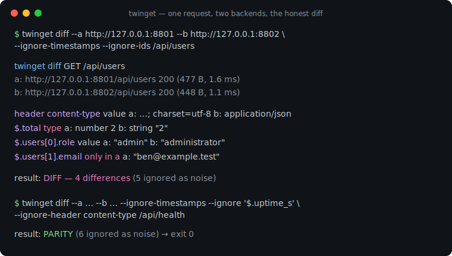
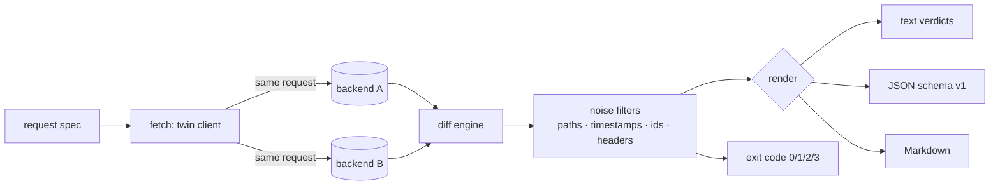

# twinget

[English](README.md) | [中文](README.zh.md) | [日本語](README.ja.md)

[](LICENSE) [](go.mod) [](CHANGELOG.md)  [](CONTRIBUTING.md)

**twinget：an open-source, zero-dependency CLI that sends one request to two backends and structurally diffs status, headers, and JSON — with noise filters for timestamps and ids, so response parity is actually provable.**



```bash
git clone https://github.com/JaydenCJ/twinget && cd twinget
go build -o twinget ./cmd/twinget    # single static binary, stdlib only
```

> Pre-release: v0.1.0 is not tagged on a package registry yet; build from source as above (any Go ≥1.22).

## Why twinget?

Every rewrite and migration — v1 to v2, Node to Go, monolith to service — ends with the same question: *does the new backend answer exactly like the old one?* Twitter's Diffy proved how valuable answering it is, but Diffy is a deployed Scala service with a dashboard, a JVM, and a proxy topology you must route production traffic through; for the everyday case ("I have two ports on my laptop or staging box") that is a mountain of ceremony. The bare-hands alternative, `curl` piped into `diff`, drowns you instantly: every response carries a fresh request id, a fresh timestamp, a different `Server` header — so everything "differs" and nothing is learned. twinget is the missing middle: one static binary that mirrors a request to both backends, diffs status, headers, and JSON *structurally* (key order and number spelling never matter), and neutralizes value-level noise with documented, conservative filters — while never masking a type change, and always telling you what it suppressed.

| | twinget | Diffy / OpenDiffy | curl + jq + diff | contract tests (Pact etc.) |
|---|---|---|---|---|
| Runs as | single-binary CLI | deployed JVM service + proxy | shell scripting | test suite in your codebase |
| Structural JSON diff with paths | ✅ `$.users[2].email` | ✅ | ❌ text lines | ⚠️ schema-level |
| Noise filters for timestamps / ids | ✅ documented rules | ✅ statistical | ❌ hand-rolled jq | n/a |
| Never masks type changes | ✅ guaranteed | ❌ noise is statistical | ❌ | ✅ |
| Exit codes for pipelines | ✅ 0/1/2/3 | ❌ dashboard | ⚠️ DIY | ✅ |
| Setup before first diff | `go build` | deploy + route traffic | write scripts | write contracts |
| Runtime dependencies | 0 (Go stdlib) | JVM + service stack | curl, jq | library + broker |

<sub>Checked 2026-07-12: twinget imports the Go standard library only; opendiffy/diffy is a Scala/Finagle service run via its own Docker image.</sub>

## Features

- **Twin mirroring, honest capture** — one request is sent to both base URLs concurrently with identical method, headers, body, and query string; redirects are deliberately not followed, because a `301` on one side *is* the finding.
- **Structural JSON diff** — bodies are compared as trees, not text: key order and number spelling (`1.0` vs `1`, `1e3` vs `1000`) never produce false diffs, and every difference lands on a precise path like `$.users[2].email` with a named kind (`value`, `type`, `only in a/b`, `length`).
- **Noise filters that show receipts** — `--ignore-timestamps` and `--ignore-ids` neutralize values only when *both* sides match the same documented shape (RFC 3339 / epoch; UUID / ULID / hex / same-prefix ids); suppressed differences are counted, listed under `--show-ignored`, and always present in JSON output.
- **Type changes always surface** — a string timestamp that became an epoch number, or `2` that became `"2"`, breaks clients; no filter can hide it.
- **Path and order control** — `--ignore '$.meta.**'` silences whole subtrees; `--unordered '$.items'` compares one array as a multiset without relaxing arrays nested inside it.
- **Header diffing with a curated noise list** — 21 volatile headers (`date`, `x-request-id`, `server`, …) are skipped by default but still recorded; `--strict-headers` compares everything, `--ignore-header` extends the list.
- **Built for pipelines** — `batch` sweeps a request file with per-request verdicts; exit codes are a contract (0 parity, 1 diff, 2 usage, 3 transport); output is text, versioned JSON (`schema_version: 1`), or PR-ready Markdown.

## Quickstart

```bash
# start the bundled demo pair: a "legacy Node" API and its "Go rewrite"
go run ./examples/demo-backends --port-a 8801 --port-b 8802 &
./twinget diff --a http://127.0.0.1:8801 --b http://127.0.0.1:8802 \
  --ignore-timestamps --ignore-ids /api/users
```

Real captured output — once the noise (fresh ids, timestamps, volatile headers) is filtered away, only genuine regressions remain:

```text
twinget diff GET /api/users
  a: http://127.0.0.1:8801/api/users  200 (477 B, 1.6 ms)
  b: http://127.0.0.1:8802/api/users  200 (448 B, 1.1 ms)

  header content-type  value      a: application/json; charset=utf-8  b: application/json
  $.total              type       a: number 2  b: string "2"
  $.users[0].role      value      a: "admin"  b: "administrator"
  $.users[1].email     only in a  a: "ben@example.test"

result: DIFF — 4 differences (5 ignored as noise)
```

When the differences that remain are accepted, parity becomes provable — and exit code 0 makes it gateable (real output):

```text
$ ./twinget diff --a http://127.0.0.1:8801 --b http://127.0.0.1:8802 \
    --ignore-timestamps --ignore '$.uptime_s' --ignore-header content-type /api/health
twinget diff GET /api/health
  a: http://127.0.0.1:8801/api/health  200 (87 B, 1.3 ms)
  b: http://127.0.0.1:8802/api/health  200 (81 B, 1.0 ms)

result: PARITY (6 ignored as noise)
```

Sweep a whole request list before flipping traffic — `twinget batch` with the same filters plus `--ignore-header content-type --ignore '$.uptime_s'` on `examples/requests.txt` (real output, per-request detail blocks elided):

```text
DIFF  GET     /api/users                       3 differences (6 ignored)
ok    GET     /api/health                      parity (6 ignored)
DIFF  GET     /api/orders/42                   7 differences (4 ignored)
DIFF  GET     /api/users?limit=1               2 differences (6 ignored)

4 requests: 1 parity, 3 diff — FAIL
```

## Noise filters

Full rules with rationale live in [docs/noise-filters.md](docs/noise-filters.md); suppressed differences are always recorded, never discarded.

| Filter | Neutralizes | Never touches |
|---|---|---|
| `--ignore PATTERN` | everything under a JSON path (`$.meta.**`, `$.users[*].id`) | paths that don't match |
| `--ignore-timestamps` | RFC 3339 / SQL / RFC 1123 strings; epoch numbers (s/ms/µs/ns, 2001–2096) | type changes, versions, bare years |
| `--ignore-ids` | UUID↔UUID, ULID↔ULID, fixed-width hex, same-prefix `req_…` ids | different shapes or prefixes |
| `--unordered PATTERN` | element order in that exact array (multiset compare) | duplicate counts, nested arrays |
| header defaults | 21 volatile headers (`date`, `x-request-id`, `server`, …) | `Content-Type`, `Location`, CORS |

## CLI reference

`twinget [diff|batch|version] [flags]` — exit codes: 0 parity, 1 differences, 2 usage error, 3 transport failure.

| Flag | Default | Effect |
|---|---|---|
| `--a`, `--b` | required | base URLs of the two backends |
| `-X`, `--method` | `GET` | HTTP method |
| `-H`, `--header` | — | extra request header `'K: V'` (repeatable) |
| `-d`, `--body` / `--body-file` | — | request body (inline / from file) |
| `--ignore` | — | ignore a JSON path pattern (repeatable) |
| `--unordered` | — | compare an array as a multiset (repeatable) |
| `--ignore-timestamps` | off | mask timestamp-shaped value churn |
| `--ignore-ids` | off | mask same-shape identifier churn |
| `--ignore-header` | — | ignore a response header by name (repeatable) |
| `--strict-headers` | off | disable the built-in volatile-header list |
| `--format` | `text` | `text`, `json`, or `markdown` |
| `--show-ignored` | off | list noise-suppressed differences too |
| `--timeout` | `10s` | per-request timeout |
| `--max-body-size` | `10485760` | per-side response body cap in bytes |

## Verification

This repository ships no CI; every claim above is verified by local runs:

```bash
go test ./...            # 90 deterministic tests, loopback only, < 5 s
bash scripts/smoke.sh    # end-to-end CLI check, prints SMOKE OK
```

## Architecture



## Roadmap

- [x] v0.1.0 — twin mirroring, structural JSON diff, timestamp/id/path/header noise filters, unordered arrays, batch mode, text/JSON/Markdown output, exit-code contract, 90 tests + smoke script
- [ ] `--jobs N` parallel batch sweeps with deterministic output ordering
- [ ] Numeric tolerance filter (`--tolerance 1e-9`) for float-heavy APIs
- [ ] HAR / access-log import to replay real traffic as a batch
- [ ] Response-time budget assertions (`--max-latency-delta`)
- [ ] Config file (`twinget.toml`) to version noise rules next to the code

See the [open issues](https://github.com/JaydenCJ/twinget/issues) for the full list.

## Contributing

Issues, discussions and pull requests are welcome — see [CONTRIBUTING.md](CONTRIBUTING.md) for the local workflow (format, vet, tests, `SMOKE OK`). Good entry points are labelled [good first issue](https://github.com/JaydenCJ/twinget/issues?q=is%3Aissue+is%3Aopen+label%3A%22good+first+issue%22), and design questions live in [Discussions](https://github.com/JaydenCJ/twinget/discussions).

## License

[MIT](LICENSE)
