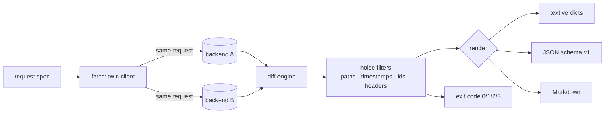

# twinget

[English](README.md) | [中文](README.zh.md) | [日本語](README.ja.md)

[](LICENSE) [](go.mod) [](CHANGELOG.md)  [](CONTRIBUTING.md)

**twinget：开源、零依赖的 CLI——把同一个请求发给两个后端，并对状态码、响应头和 JSON 做结构化对比；内置时间戳与 id 噪音过滤器，让"响应一致性"真正可以被证明。**


```bash
git clone https://github.com/JaydenCJ/twinget && cd twinget
go build -o twinget ./cmd/twinget    # single static binary, stdlib only
```

> 预发布：v0.1.0 尚未发布到任何包仓库；请按上面的方式从源码构建（任意 Go ≥1.22）。

## 为什么选 twinget？

每一次重写和迁移——v1 到 v2、Node 到 Go、单体到服务——最终都归结为同一个问题：*新后端的回答和旧后端完全一样吗？* Twitter 的 Diffy 证明了回答这个问题有多值钱，但 Diffy 是一个需要部署的 Scala 服务：带仪表盘、要 JVM、还得把生产流量路由进它的代理拓扑；对于日常场景（"我笔记本或 staging 机器上就开着两个端口"）来说，这是一座仪式感大山。而徒手方案——`curl` 管道进 `diff`——会立刻把你淹没：每个响应都带着新的 request id、新的时间戳、不同的 `Server` 头，于是一切都"不一样"，什么也学不到。twinget 补上了中间的缺口：一个静态二进制，把请求镜像到两个后端，对状态码、响应头和 JSON 做*结构化*对比（键顺序与数字写法从不误报），再用有明确文档、保守克制的过滤器中和值级噪音——同时绝不掩盖类型变化，并始终告诉你它压掉了什么。

| | twinget | Diffy / OpenDiffy | curl + jq + diff | 契约测试（Pact 等） |
|---|---|---|---|---|
| 运行形态 | 单二进制 CLI | 需部署的 JVM 服务 + 代理 | shell 脚本 | 代码库里的测试套件 |
| 带路径的结构化 JSON diff | ✅ `$.users[2].email` | ✅ | ❌ 文本行 | ⚠️ 仅 schema 层面 |
| 时间戳 / id 噪音过滤 | ✅ 规则有文档 | ✅ 统计式 | ❌ 手写 jq | 不适用 |
| 绝不掩盖类型变化 | ✅ 有保证 | ❌ 噪音判定是统计的 | ❌ | ✅ |
| 面向流水线的退出码 | ✅ 0/1/2/3 | ❌ 仪表盘 | ⚠️ 自己拼 | ✅ |
| 第一次 diff 前的准备 | `go build` | 部署 + 引流 | 写脚本 | 写契约 |
| 运行时依赖 | 0（Go 标准库） | JVM + 服务栈 | curl、jq | 库 + broker |

<sub>核查于 2026-07-12：twinget 只引用 Go 标准库；opendiffy/diffy 是 Scala/Finagle 服务，须经其官方 Docker 镜像运行。</sub>

## 功能特性

- **孪生镜像、诚实捕获** —— 同一个请求以相同的方法、请求头、请求体和查询串并发发往两个 base URL；重定向被有意不跟随，因为某一侧返回 `301` 本身*就是*发现。
- **结构化 JSON diff** —— 响应体按树而非文本对比：键顺序和数字写法（`1.0` vs `1`、`1e3` vs `1000`）从不产生假差异，每处差异都落在 `$.users[2].email` 这样的精确路径上，并带有命名的类别（`value`、`type`、`only in a/b`、`length`）。
- **有据可查的噪音过滤** —— `--ignore-timestamps` 和 `--ignore-ids` 只在*两侧*都命中同一种文档化形状时才中和（RFC 3339 / epoch；UUID / ULID / hex / 同前缀 id）；被压掉的差异会计数、可用 `--show-ignored` 列出，并始终出现在 JSON 输出里。
- **类型变化永远浮出水面** —— 字符串时间戳变成了 epoch 数字、`2` 变成了 `"2"`，都会弄坏客户端；任何过滤器都藏不住它。
- **路径与顺序控制** —— `--ignore '$.meta.**'` 静音整棵子树；`--unordered '$.items'` 把某个数组按多重集合对比，而不放松其元素内部嵌套的数组。
- **带精选噪音清单的响应头 diff** —— 21 个易变头（`date`、`x-request-id`、`server`……）默认跳过但仍被记录；`--strict-headers` 全量对比，`--ignore-header` 可扩充清单。
- **为流水线而生** —— `batch` 扫一份请求清单并逐条给出裁定；退出码是契约（0 一致、1 有差异、2 用法错误、3 传输失败）；输出有文本、带版本的 JSON（`schema_version: 1`）和可直接贴 PR 的 Markdown。

## 快速上手

```bash
# start the bundled demo pair: a "legacy Node" API and its "Go rewrite"
go run ./examples/demo-backends --port-a 8801 --port-b 8802 &
./twinget diff --a http://127.0.0.1:8801 --b http://127.0.0.1:8802 \
  --ignore-timestamps --ignore-ids /api/users
```

真实捕获的输出——把噪音（新 id、时间戳、易变头）滤掉之后，剩下的全是货真价实的回归：

```text
twinget diff GET /api/users
  a: http://127.0.0.1:8801/api/users  200 (477 B, 1.6 ms)
  b: http://127.0.0.1:8802/api/users  200 (448 B, 1.1 ms)

  header content-type  value      a: application/json; charset=utf-8  b: application/json
  $.total              type       a: number 2  b: string "2"
  $.users[0].role      value      a: "admin"  b: "administrator"
  $.users[1].email     only in a  a: "ben@example.test"

result: DIFF — 4 differences (5 ignored as noise)
```

当剩余差异都被接受后，一致性就变得可证明——退出码 0 让它可以作闸门（真实输出）：

```text
$ ./twinget diff --a http://127.0.0.1:8801 --b http://127.0.0.1:8802 \
    --ignore-timestamps --ignore '$.uptime_s' --ignore-header content-type /api/health
twinget diff GET /api/health
  a: http://127.0.0.1:8801/api/health  200 (87 B, 1.3 ms)
  b: http://127.0.0.1:8802/api/health  200 (81 B, 1.0 ms)

result: PARITY (6 ignored as noise)
```

切流量之前扫完整个请求清单——对 `examples/requests.txt` 运行 `twinget batch`，沿用上面的过滤器并追加 `--ignore-header content-type --ignore '$.uptime_s'`（真实输出，省略了逐请求明细块）：

```text
DIFF  GET     /api/users                       3 differences (6 ignored)
ok    GET     /api/health                      parity (6 ignored)
DIFF  GET     /api/orders/42                   7 differences (4 ignored)
DIFF  GET     /api/users?limit=1               2 differences (6 ignored)

4 requests: 1 parity, 3 diff — FAIL
```

## 噪音过滤器

完整规则及其理由见 [docs/noise-filters.md](docs/noise-filters.md)；被压掉的差异永远会被记录，绝不丢弃。

| 过滤器 | 中和什么 | 绝不触碰什么 |
|---|---|---|
| `--ignore PATTERN` | 某 JSON 路径下的一切（`$.meta.**`、`$.users[*].id`） | 不匹配的路径 |
| `--ignore-timestamps` | RFC 3339 / SQL / RFC 1123 字符串；epoch 数字（秒/毫秒/微秒/纳秒，2001–2096） | 类型变化、版本号、孤立年份 |
| `--ignore-ids` | UUID↔UUID、ULID↔ULID、定宽 hex、同前缀 `req_…` id | 形状或前缀不同者 |
| `--unordered PATTERN` | 恰好该数组内的元素顺序（多重集合对比） | 重复个数、嵌套数组 |
| 响应头默认清单 | 21 个易变头（`date`、`x-request-id`、`server`……） | `Content-Type`、`Location`、CORS |

## CLI 参考

`twinget [diff|batch|version] [flags]` —— 退出码：0 一致、1 有差异、2 用法错误、3 传输失败。

| 标志 | 默认值 | 作用 |
|---|---|---|
| `--a`, `--b` | 必填 | 两个后端的 base URL |
| `-X`, `--method` | `GET` | HTTP 方法 |
| `-H`, `--header` | — | 额外请求头 `'K: V'`（可重复） |
| `-d`, `--body` / `--body-file` | — | 请求体（内联 / 来自文件） |
| `--ignore` | — | 忽略某 JSON 路径模式（可重复） |
| `--unordered` | — | 把某数组按多重集合对比（可重复） |
| `--ignore-timestamps` | 关 | 掩掉时间戳形状的值抖动 |
| `--ignore-ids` | 关 | 掩掉同形状标识符的抖动 |
| `--ignore-header` | — | 按名字忽略某响应头（可重复） |
| `--strict-headers` | 关 | 停用内置易变头清单 |
| `--format` | `text` | `text`、`json` 或 `markdown` |
| `--show-ignored` | 关 | 连同被噪音压掉的差异一并列出 |
| `--timeout` | `10s` | 单请求超时 |
| `--max-body-size` | `10485760` | 每侧响应体字节上限 |

## 验证

本仓库不带任何 CI；上面的每一条断言都由本地运行来验证：

```bash
go test ./...            # 90 deterministic tests, loopback only, < 5 s
bash scripts/smoke.sh    # end-to-end CLI check, prints SMOKE OK
```

## 架构



## 路线图

- [x] v0.1.0 —— 孪生镜像、结构化 JSON diff、时间戳/id/路径/响应头噪音过滤、无序数组、批量模式、text/JSON/Markdown 输出、退出码契约、90 个测试 + smoke 脚本
- [ ] `--jobs N` 并行批量扫描，输出顺序保持确定
- [ ] 数值容差过滤器（`--tolerance 1e-9`），服务浮点密集型 API
- [ ] 导入 HAR / 访问日志，把真实流量当作批量清单回放
- [ ] 响应耗时预算断言（`--max-latency-delta`）
- [ ] 配置文件（`twinget.toml`），让噪音规则与代码一起进版本库

完整列表见 [open issues](https://github.com/JaydenCJ/twinget/issues)。

## 参与贡献

欢迎 issue、讨论与 PR——本地工作流（格式化、vet、测试、`SMOKE OK`）见 [CONTRIBUTING.md](CONTRIBUTING.md)。入门任务标为 [good first issue](https://github.com/JaydenCJ/twinget/issues?q=is%3Aissue+is%3Aopen+label%3A%22good+first+issue%22)，设计讨论在 [Discussions](https://github.com/JaydenCJ/twinget/discussions)。

## 许可证

[MIT](LICENSE)
